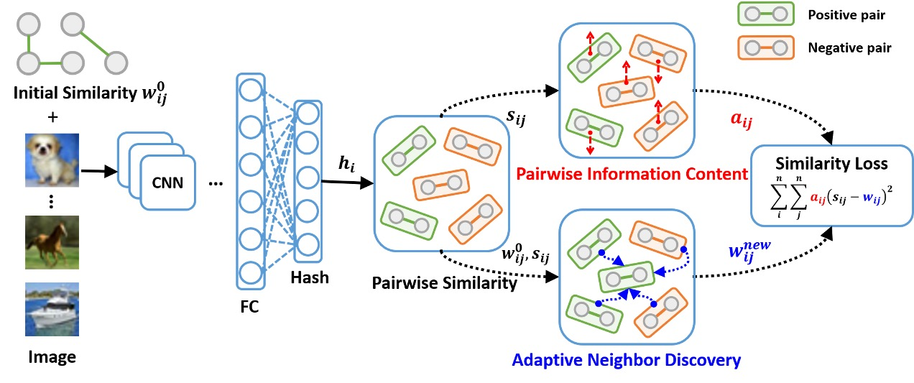

# DSAH

This is the official Tensorflow implementation for our CIKM'22 paper [Deep Self-Adaptive Hashing for Image Retrieval.](https://arxiv.org/pdf/2108.07094.pdf)



## Preparation
1. Install dependencies 
```bash
conda create -n dsah python=3.6
source activate dsah
pip install -r requirements.txt
``` 
2. Download the VGG pretrained weights from [here](https://drive.google.com/file/d/1-y6oiITnVKjNkNSVds5mkLI_oamX65LE/view?usp=sharing).
3. Download the pre-extracted features, RGB data for [CIFAR-10](https://drive.google.com/drive/folders/1-8gwTfQ3KQctq2eO70_qBs02VKNNaNHr?usp=sharing), [FLICKR25K](https://drive.google.com/drive/folders/1-MeiPbnkWj6Chk8DgiXYW6m432HlHQmp?usp=sharing) and [NUS-WIDE](https://drive.google.com/drive/folders/10-20iH7bygpk88xKq8toninlOOuR8ezE?usp=sharing) datasets.
4. Create an initial similarity matrix based on `W_create.py` for each datasets.

## Training & Eval
1. Run `train_cifar_gpu.sh` or `run_cifar_gpu.py` to train the hash model, which will save the hash code during training.
2. Run `eval.py` to evaluate the retrieval performance of saved hash code.

## Citation

If you find our work helps, please cite our paper.

```bibtex
@inproceedings{lin2021deep,
  title={Deep Self-Adaptive Hashing for Image Retrieval},
  author={Lin, Qinghong and Chen, Xiaojun and Zhang, Qin and Tian, Shangxuan and Chen, Yudong},
  booktitle={Proceedings of the 30th ACM International Conference on Information \& Knowledge Management},
  pages={1028--1037},
  year={2021}
}
```
